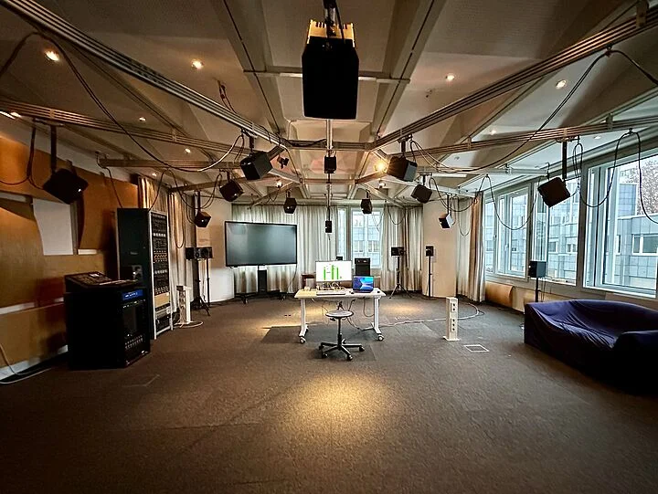

# E-N 324 Intro

The *Large Studio* is used for production, classes and workshops.
The setup consists of two K&H O 300D speakers for stereo playback, 21-channel Neumann KH120 speakers setup in a dome, and a D&B-Subwoofer.

The *Large Studio* can be used in two modes: [Stereo Mode](stereo-mode.md) and [Multichannel Mode](multichannel-mode.md)

