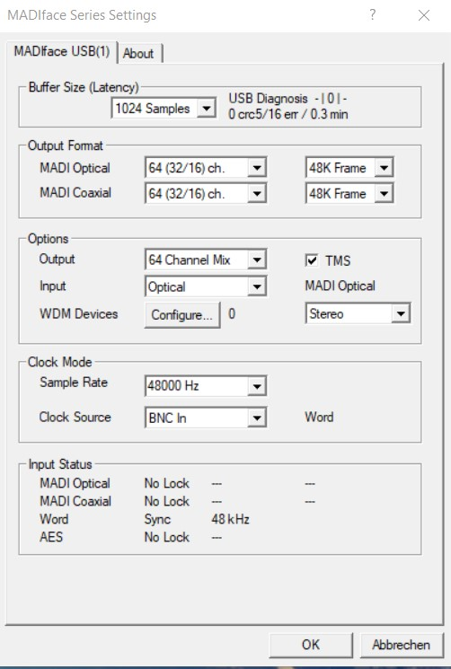
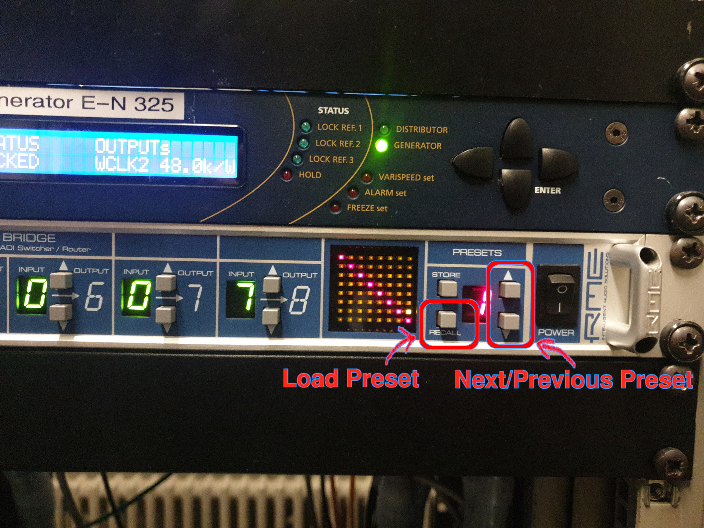
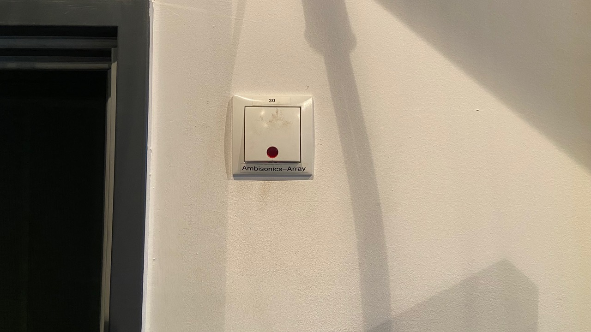

# E-N 325 Direct Mode

Using this mode, the ambisonics dome, subwoofers and the HEDD octa speakers can be accessed directly.

They follow this audio channel layout:

| Channel | Speaker |
| --- | --- |
| 1-21 | Genelec Dome |
| 23-24 | Subs |
| 25-32 | HEDD speakers |

!!! warning "Important"   
    - Turn off ALL speakers when leaving!
    - Make sure the power is turned off (power key 0) when leaving the studio
    - Leave the place tidy (e.g. move table back, move chairs to the back)

## First Steps
1. Connect your Computer to the interface (MADIface USB)
2. Turn the power key to I (beside the door)
3. (if not already installed) Install [drivers](https://www.rme-audio.de/de_madiface-usb.html) for the MADIface (not the firmware update)

## User Guide Direct Mode
1. Download correct TotalMix config [here](../configs.md) and import it into TotalMix
2. Make sure all Fadergroups are turned down
3. Set the MADIface Settings to the correct values

    ??? info "MADIface Settings"
        {: style="width:400px"}

4. In the machineroom:
    1. Set MADI-Bridge to preset 1
    2. Hold the *recall* button to load the preset (not the *store* button!)
    ??? info "MADI-Bridge"
        {: style="width:600px"}

5. Turn on the speakers that you want to use
    - Octa HEDD Speakers: by pressing "Lautsprecher 1" and "Lautsprecher 2" on the control panel

        ??? info "control panel
            TODO include picture of control panel

    - Ambisonics dome with the switch beside the door     
    
        ??? info "Ambisonics Power Switch"
            {: style="width:600px"}

6. Play back audio throught the MADIface USB
    - the positions of the speakers and configs for use with the IEM Plugins can be found [here](../configs.md)

7. Have Fun!

8. When Leaving:
    - turn off ALL speakers
    - turn off the power using the power key (set to 0)
    - leave the space tidy