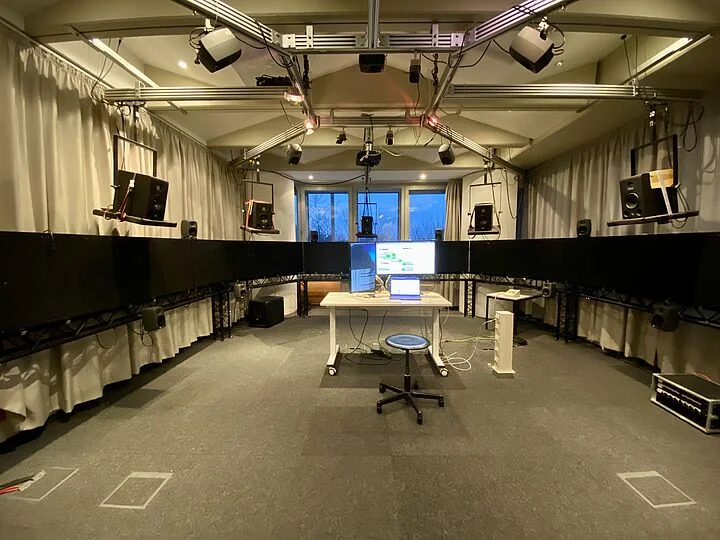

# E-N 325 Intro

The *Small Studio* is equipped with a combined WFS/Ambisonics sound field synthesis system for production and research, alongside an eight channel loudspeaker setup for regular production. 

The Small Studio can be used in two Modes: Direct Mode and Seamless Mode.

Direct Mode allows direct access to the speakers in the octa setup and the Ambisonics Dome. The Seamless mode uses a rendering system to spatialize up to 32 seperate audio channels into the Ambisonics dome and the WFS-System. 
# Using the Studio

!!! warning "Important"   
    - Turn off the WFS-Panels and ALL speakers when leaving!
    - Make sure the power is turned off (power key 0) when leaving the studio!
    - Leave the place tidy (e.g. move table back, move chairs to the back)

1. Connect your Computer to the interface (MADIface USB) and the local Network using the USB-C Hub on the desk
    - (*if not already installed*) Install [drivers](https://www.rme-audio.de/de_madiface-usb.html) for the MADIface (not the firmware update)
2. Turn the power key to I (beside the door)
4. Choose Operation Mode of the Studio
    - [Direct Mode](direct-mode.md)
    - [Seamless Mode](seamless-mode.md)

