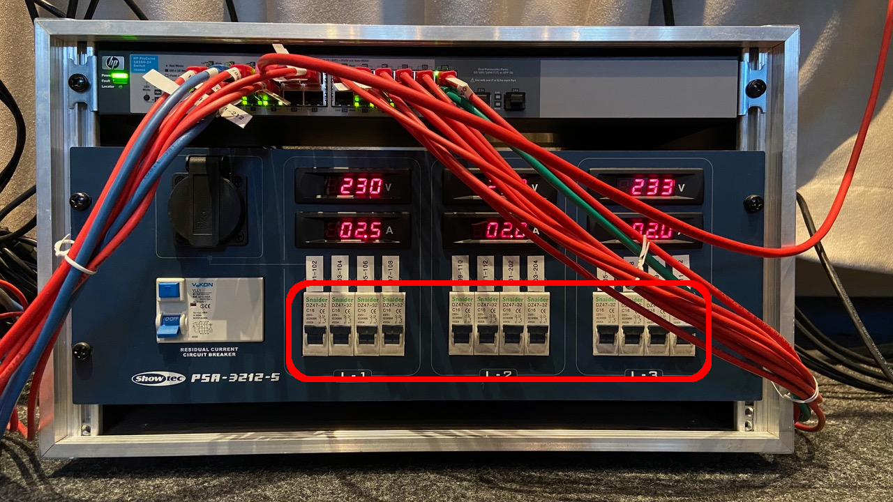

# E-N 325 Seamless Mode

Using this mode, both the ambisonics dome and the WFS-system can be controlled using the same interface.

Up to 32 channels of mono-audio are sent to the rendering computers, which are controlled with the specialized Seamless-Plugins.

The channel layout is as follows:

| Channels | Seamless Mapping             |
| -------- | ---------------------------- |
| 1-32     | (Mono) Sources               |
| 33-48    | Encoded 3rd Order Ambisonics |
| 50       | LFE direct                   |

!!! warning "Important"
    - Turn off the WFS-Panels and ALL speakers when leaving! - Make sure the power is turned off (power key 0) when leaving the studio - Leave the place tidy (e.g. move table back, move chairs to the back)

## First Steps

1. Connect your Computer to the interface (MADIface USB) and the local Network using the USB-C Hub on the desk
2. Turn the power key to I (beside the door)
3. _(if not already installed)_ Install [drivers](https://www.rme-audio.de/de_madiface-usb.html) for the MADIface (not the firmware update)

## User Guide Seamless Mode

1. Download correct TotalMix config [here](../configs.md) and import it into TotalMix
2. Make sure all Fadergroups are turned down
3. Set the MADIface Settings to the correct values

??? info "MADIface Settings"
    {: style="width:400px"}

4. In the machineroom:

    1. Set MADI-Bridge to preset 2
    2. Hold the _recall_ button to load the preset (not the _store_ button!)
    ??? info "MADI-Bridge"
        {: style="width:600px"}
    3. Turn on the rendering servers:
        - Riviera: OSC-Kreuz, Ambisonics, WFS 1-64
        - Wintermute: WFS 65-192

5. Turn on

    - Ambisonics dome with the power switch besides the door
    ??? info "Ambisonics Power Switch"
        {: style="width:600px"}
    - WFS-Panels with the 12 power switches in the rack on the ground. The UP position is ON, the DOWN position is OFF.
    ??? info "WFS Power Switches"
        {: style="width:600px"}
      Power switches are marked in red.

6. **Carefully** close WFS ring. Grip on to the moveable panel on the bottom to not knock it over

7. _(if not already installed)_ Download the [Seamless Plugin Suite](https://github.com/TU-Studio/seamless-plugin-suite/releases/latest) for your Operating System

    1. Extract the Zip file
    2. Move the VST3 to your system VST3 folder or use the standalone Plugins

8. The seamless system is controled via OSC e.g. with the seamless plugins.

    - Your computer has to be in the wired network in the studio. On MacOS it might be necessary to disable WiFi.
      First configure the main plugin: - Set the OSC Send Adress to the Address of the OSC-Router - ip-address: riviera.ak.tu-berlin.de - port (oscrouter): 4455

9. Play audio through the MADIface

10. Use a client plugin on each track to contol the gain of the HOA and WFS System as well as the position of the source

     - Set the Source Index to the channel number of the source
     - Set the HOA Gain to the desired gain of the HOA System
     - Set the WFS Gain to the desired gain of the WFS System
     - Position the source

11. When Leaving:
     - turn off the WFS-Panels and ALL speakers
     - turn off the power using the power key (set to 0)
        - this turns off the rendering servers as well
     - leave the space tidy
